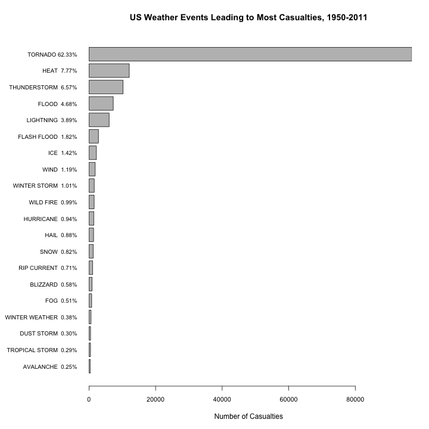
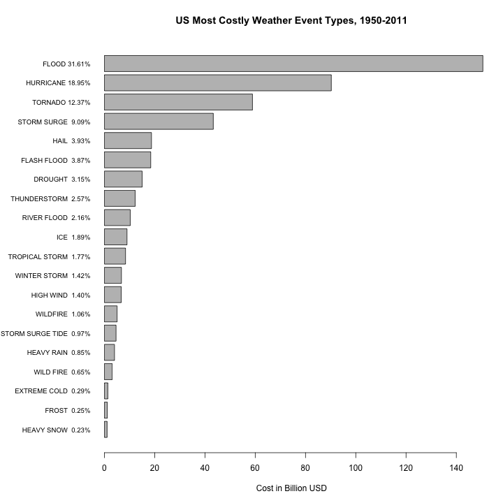

<style>
body, th, td, p {
    font-size: 1.0em;
    font-family: "Arial, Helvetica, sans-serif"";
}
table {
   max-width: 95%;
   border: 1px solid #ccc;
   padding: 10px 10px 10px 10px; 
}
th {
  background-color: #000000;
  color: #ffffff;
   padding: 10px 10px 10px 10px; 
}
td {
  background-color: #dcdcdc;
   padding: 10px 10px 10px 10px; 
}
</style>

## Analysis of Public Health and Economy Impacts of Weather Events in the US, from 1950 to 2011

### Synopsis

Severe weather events can cause both public health and economic problems for communities and municipalities. Many severe events result in fatalities, injuries, and property damage.

The goal of this assignment is to explore the U.S. National Oceanic and Atmospheric Administration's (NOAA) Storm Database and determine, across the United States, which types of events are most harmful with respect to population health, and which types of events have the greatest economic consequences.

The NOAA database records characteristics of major weather events in the US, from 1950 to 2011. In this work, we correlate the events type with the estimated resulting cost for communities (distinguishing properties and crop damages), and the impact of population health through recorded fatalities and injuries.


### Data Processing

#### Initialization

We clean-up our workspace, set the seed for reproducibility, remember processing date and time and R version for reference, and show the parameters of the session. 

```
## R version 3.1.0 (2014-04-10)
## Platform: x86_64-apple-darwin13.1.0 (64-bit)
## 
## locale:
## [1] en_US.UTF-8/en_US.UTF-8/en_US.UTF-8/C/en_US.UTF-8/en_US.UTF-8
## 
## attached base packages:
## [1] stats     graphics  grDevices utils     datasets  methods   base     
## 
## other attached packages:
## [1] xtable_1.7-3    lattice_0.20-29 knitr_1.6      
## 
## loaded via a namespace (and not attached):
## [1] evaluate_0.5.5 formatR_0.10   grid_3.1.0     stringr_0.6.2 
## [5] tools_3.1.0
```


#### Downloading data

The data for this assignment comes in the form of a comma-separated-value compressed file downloaded from https://d396qusza40orc.cloudfront.net/repdata%2Fdata%2FStormData.csv.bz2. The following code download this file if necessary and keep the date and time when the download occurred for future reference.


```r
# baseDir will be prefixing all data accesses
baseDir <- ".."

# create data sub-directory if necessary
dataDir <- file.path(baseDir, "data")
if(!file.exists(dataDir)) { dir.create(dataDir) }

zipFilePath <- file.path(dataDir, "StormData.csv.bz2")
dateFilePath <- file.path(dataDir, "date_time_downloaded.txt")
# download original data if necessary (skip if exists already as it takes time and bandwith)
# just delete the bz2 file in data subdir to trigger a fresh download
if (!file.exists(zipFilePath)) { 
  zipFileUrl <- "https://d396qusza40orc.cloudfront.net/repdata%2Fdata%2FStormData.csv.bz2"
  download.file (zipFileUrl, zipFilePath, method="curl")
  DTDownloaded <- format(Sys.time(), "%Y-%b-%d %H:%M:%S")
  cat (DTDownloaded, file=dateFilePath)
} else {
  DTDownloaded <- scan(file=dateFilePath, what="character", sep="\n")
}
```


#### Reading data

We load data in R using read.csv and bzfile to uncompress it. 

```r
# read dataset and load data in R
dataset.raw <- read.csv(bzfile(zipFilePath), header = TRUE) 
```

The downloaded NOAA dataset is located at ``../data/StormData.csv.bz2`` and was downloaded on ``2014-Jun-18 09:41:03``. This raw dataset contains ``902297`` observations and ``37`` variables.

The documentation was downloaded from the National Weather Service Storm Data Documentation [1] and from the National Climatic Data Center Storm Events FAQ [2].

This analysis has been performed using R software package for statistical analysis [3]. The version of R used was R version 3.1.0 (2014-04-10).


### Description and justification for data transformations.

#### Selecting variables

Looking at the raw dataset and its documentation, only some variables will be interesting for this work, mainly:
  - EVTYPE: event type.
  - FATALITIES: number of dead people resulting from the event.
  - INJURIES: number of non fatal casualties.
  - PROPDMG and PROPDMGEXP: property damage in USD, PROPDMG being the mantissa (significand) and PROPDMGEXP the exponent.
  - CROPDMG and CROPDMGEXP: crop damage in USD, CROPDMG being the mantissa and CROPDMGEXP the exponent.
  - BNG_DATE, END_DATE: start/end date, useful if we want to calculate the duration of the event.
  - STATE: state where the event occurred, if we want to show the geographic variations.

Let's start with selecting only these variables to start our tidy dataset:

```r
dataset.tidy <- dataset.raw[, c("EVTYPE", "FATALITIES", "INJURIES", 
                     "PROPDMG", "PROPDMGEXP", "CROPDMG", "CROPDMGEXP",
                     "BGN_DATE", "END_DATE", "STATE") ]
```


#### Health Impacts

Health impacts are recorded through two variables: FATALITIES and INJURIES. Let's calculate the total number of casualties in the variable CASUALTIES:


```r
dataset.tidy$CASUALTIES <- dataset.tidy$FATALITIES + dataset.tidy$INJURIES
```
The number of casualties ranges from ``0`` to ``1742``.


#### Calculating costs

We now want to calculate some actual dollars from PROPDMG, PROPDMGEXP, CROPDMG and CROPDMGEXP in newly created variables: PROP_COST, CROP_COST, and TOTAL_COST. According to the documentation, xROPDMGEXP variables are supposed to contain K, M, or B, for Kilo, Million, Billion. But a quick table scan shows that we can also find several other characters. 

```r
t1 <- as.data.frame(table(dataset.tidy$PROPDMGEXP))
t2 <- as.data.frame(table(dataset.tidy$CROPDMGEXP))
tt <- merge(t1,t2,by="Var1",all.x=T,all.y=T)
colnames( tt ) <- c("Value","Count Prop","Count Crop")
print (xtable(tt,caption="-ROPDMGEXP variable"), type="html", include.rownames=FALSE)
```

<!-- html table generated in R 3.1.0 by xtable 1.7-3 package -->
<!-- Sun Jun 22 15:24:58 2014 -->
<TABLE border=1>
<CAPTION ALIGN="bottom"> -ROPDMGEXP variable </CAPTION>
<TR> <TH> Value </TH> <TH> Count Prop </TH> <TH> Count Crop </TH>  </TR>
  <TR> <TD>  </TD> <TD align="right"> 465934 </TD> <TD align="right"> 618413 </TD> </TR>
  <TR> <TD> - </TD> <TD align="right">   1 </TD> <TD align="right">  </TD> </TR>
  <TR> <TD> ? </TD> <TD align="right">   8 </TD> <TD align="right">   7 </TD> </TR>
  <TR> <TD> + </TD> <TD align="right">   5 </TD> <TD align="right">  </TD> </TR>
  <TR> <TD> 0 </TD> <TD align="right"> 216 </TD> <TD align="right">  19 </TD> </TR>
  <TR> <TD> 1 </TD> <TD align="right">  25 </TD> <TD align="right">  </TD> </TR>
  <TR> <TD> 2 </TD> <TD align="right">  13 </TD> <TD align="right">   1 </TD> </TR>
  <TR> <TD> 3 </TD> <TD align="right">   4 </TD> <TD align="right">  </TD> </TR>
  <TR> <TD> 4 </TD> <TD align="right">   4 </TD> <TD align="right">  </TD> </TR>
  <TR> <TD> 5 </TD> <TD align="right">  28 </TD> <TD align="right">  </TD> </TR>
  <TR> <TD> 6 </TD> <TD align="right">   4 </TD> <TD align="right">  </TD> </TR>
  <TR> <TD> 7 </TD> <TD align="right">   5 </TD> <TD align="right">  </TD> </TR>
  <TR> <TD> 8 </TD> <TD align="right">   1 </TD> <TD align="right">  </TD> </TR>
  <TR> <TD> B </TD> <TD align="right">  40 </TD> <TD align="right">   9 </TD> </TR>
  <TR> <TD> h </TD> <TD align="right">   1 </TD> <TD align="right">  </TD> </TR>
  <TR> <TD> H </TD> <TD align="right">   6 </TD> <TD align="right">  </TD> </TR>
  <TR> <TD> K </TD> <TD align="right"> 424665 </TD> <TD align="right"> 281832 </TD> </TR>
  <TR> <TD> m </TD> <TD align="right">   7 </TD> <TD align="right">   1 </TD> </TR>
  <TR> <TD> M </TD> <TD align="right"> 11330 </TD> <TD align="right"> 1994 </TD> </TR>
  <TR> <TD> k </TD> <TD align="right">  </TD> <TD align="right">  21 </TD> </TR>
   </TABLE>

Thus, we generate NA in the xxx_COST variables for all records whose variable PROPDMGEXP or CROPDMGEXP doesn't show empty, K, M, or B (being insensitive to case). For correct exponent, we adjust the numbers accordingly.


```r
f <- function(x) {
  x <- toupper(x);
  if (x == "") return (1);
  if (x == "K") return (1000);
  if (x == "M") return (1000000);
  if (x == "B") return (1000000000);
  return (NA);
}
dataset.tidy$PROP_COST <- with(dataset.tidy, as.numeric(PROPDMG)  * sapply(PROPDMGEXP,f))
dataset.tidy$CROP_COST <- with(dataset.tidy, as.numeric(CROPDMG) * sapply(CROPDMGEXP,f))
dataset.tidy$TOTAL_COST <- dataset.tidy$PROP_COST + dataset.tidy$CROP_COST
```


#### Evaluating dates and duration

Then, let's create additional variables: DATE_START, DATE_END, YEAR, and DURATION. In the raw dataset, BNG_START is recorded as a factor but want to have a start date available as an actual date that could be manipulated. DURATION will be created as a number of hours, neglecting the time VARIABLES for now.


```r
dataset.tidy$DATE_START <- strptime(as.character(dataset.tidy$BGN_DATE), "%m/%d/%Y")
dataset.tidy$DATE_END <- strptime(as.character(dataset.tidy$END_DATE), "%m/%d/%Y")
dataset.tidy$YEAR <- as.integer(format(dataset.tidy$DATE_START, "%Y"))
dataset.tidy$DURATION <- as.numeric(dataset.tidy$DATE_END - dataset.tidy$DATE_START)/3600
```

We verify that the records range from ``1950`` to ``2011``.


#### Working on event types

The type of event is determined by the variable EVTYPE. Looking at the raw dataset, we can see that EVTYPE is not cleanly recorded. Some same events are recorded with different names (e.g "THUNDERTORM WINDS", "THUNDERSTORMWINDS", "THUNDERSTROM WIND"), different events are grouped within the same records (e.g. "GUSTY WIND/HVY RAIN"), and some records show summary instead of individual events (e.g. "Summary of June 3").

```r
nev0 <- length(sort(unique(dataset.tidy$EVTYPE)))
```
There are ``985`` different event types in the initial dataset.

We first delete the daily summaries which don't correspond to an event:

```r
dataset.tidy <- subset(dataset.tidy, substr(EVTYPE,1,7) != "Summary")
```

Then, in order to normalize EVTYPE, we perform the following transformations:
  - Normalize the letter-case.
  - Suppress plural marks.
  - Correct spelling issues.
  - Regroup similar events.


```r
dataset.tidy$EVTYPE <- toupper(dataset.tidy$EVTYPE)
dataset.tidy$EVTYPE <- gsub("/"," ",dataset.tidy$EVTYPE) # might select one instead
dataset.tidy$EVTYPE <- gsub("  "," ",dataset.tidy$EVTYPE)
dataset.tidy$EVTYPE <- sub("^ ","",dataset.tidy$EVTYPE)
dataset.tidy$EVTYPE <- sub("^SEVERE ","",dataset.tidy$EVTYPE) 
dataset.tidy$EVTYPE <- sub("^RECORD ","",dataset.tidy$EVTYPE) 
dataset.tidy$EVTYPE <- sub("^UNSEASONABLY ","",dataset.tidy$EVTYPE) 
dataset.tidy$EVTYPE <- sub("^UNSEASONABLY ","",dataset.tidy$EVTYPE) 
dataset.tidy$EVTYPE <- sub("^UNSEASONABLE ","",dataset.tidy$EVTYPE) 
dataset.tidy$EVTYPE <- sub("^UNSEASONAL ","",dataset.tidy$EVTYPE) 
dataset.tidy$EVTYPE <- gsub("SML ","SMALL ",dataset.tidy$EVTYPE)
dataset.tidy$EVTYPE <- gsub("FLD","FLOOD",dataset.tidy$EVTYPE)
dataset.tidy$EVTYPE <- gsub("WINTERY","WINTER",dataset.tidy$EVTYPE)
dataset.tidy$EVTYPE <- gsub("WINTRY","WINTER",dataset.tidy$EVTYPE)
dataset.tidy$EVTYPE <- gsub("TSTM","THUNDERSTORM",dataset.tidy$EVTYPE)
dataset.tidy$EVTYPE <- gsub("HVY","HEAVY",dataset.tidy$EVTYPE)
dataset.tidy$EVTYPE <- gsub("FOREST FIRE","FIRE",dataset.tidy$EVTYPE)
dataset.tidy$EVTYPE <- gsub("FLOODING","FLOOD",dataset.tidy$EVTYPE)
dataset.tidy$EVTYPE <- gsub("FLDG","FLOOD",dataset.tidy$EVTYPE)
dataset.tidy$EVTYPE <- gsub("LIGHTING","LIGHTNING",dataset.tidy$EVTYPE)
dataset.tidy$EVTYPE <- gsub("LIGNTNING","LIGHTNING",dataset.tidy$EVTYPE)
dataset.tidy$EVTYPE <- gsub("FLOOD FLASH","FLASH FLOOD",dataset.tidy$EVTYPE)
dataset.tidy$EVTYPE <- gsub("^FLASH FLOOD.+$","FLASH FLOOD",dataset.tidy$EVTYPE)
dataset.tidy$EVTYPE <- gsub("^FLOOD.+$","FLOOD",dataset.tidy$EVTYPE)
dataset.tidy$EVTYPE <- gsub("THUNDERTORM","THUNDERSTORM",dataset.tidy$EVTYPE)
dataset.tidy$EVTYPE <- gsub("THUNDESTORM","THUNDERSTORM",dataset.tidy$EVTYPE)
dataset.tidy$EVTYPE <- gsub("THUDERSTORM","THUNDERSTORM",dataset.tidy$EVTYPE)
dataset.tidy$EVTYPE <- gsub("THUNDERSTROM","THUNDERSTORM",dataset.tidy$EVTYPE)
dataset.tidy$EVTYPE <- gsub("THUNDERTSROM","THUNDERSTORM",dataset.tidy$EVTYPE)
dataset.tidy$EVTYPE <- gsub("THUNERSTORM","THUNDERSTORM",dataset.tidy$EVTYPE)
dataset.tidy$EVTYPE <- gsub("THUNDERESTORM","THUNDERSTORM",dataset.tidy$EVTYPE)
dataset.tidy$EVTYPE <- gsub("THUNDEERSTORM","THUNDERSTORM",dataset.tidy$EVTYPE)
dataset.tidy$EVTYPE <- gsub("THUNDERTSORM","THUNDERSTORM",dataset.tidy$EVTYPE)
dataset.tidy$EVTYPE <- gsub("^THUNDERSTORM? WIND.+$","THUNDERSTORM WINDS",dataset.tidy$EVTYPE)
dataset.tidy$EVTYPE <- gsub("^THUNDERSTORM.+$","THUNDERSTORM",dataset.tidy$EVTYPE)
dataset.tidy$EVTYPE <- gsub("TORNADOE","TORNADO",dataset.tidy$EVTYPE)
dataset.tidy$EVTYPE <- gsub("TORNADOES","TORNADO",dataset.tidy$EVTYPE)
dataset.tidy$EVTYPE <- gsub("TORNDAO","TORNADO",dataset.tidy$EVTYPE)
dataset.tidy$EVTYPE <- gsub("^TORNADO.+$","TORNADO",dataset.tidy$EVTYPE)
dataset.tidy$EVTYPE <- gsub("^HURRICANE.+$","HURRICANE",dataset.tidy$EVTYPE)
dataset.tidy$EVTYPE <- gsub("^TROPICAL STORM.+$","TROPICAL STORM",dataset.tidy$EVTYPE)
dataset.tidy$EVTYPE <- gsub("^SNOW.+$","SNOW",dataset.tidy$EVTYPE)
dataset.tidy$EVTYPE <- gsub("^HIGH WIND.+$","HIGH WIND",dataset.tidy$EVTYPE)
dataset.tidy$EVTYPE <- gsub("^LIGHTNING.+$","LIGHTNING",dataset.tidy$EVTYPE)
dataset.tidy$EVTYPE <- gsub("^ICE .+$","ICE",dataset.tidy$EVTYPE)
dataset.tidy$EVTYPE <- gsub("^HAIL .+$","HAIL",dataset.tidy$EVTYPE)
dataset.tidy$EVTYPE <- gsub("^HEAVY RAIN.+$","HEAVY RAIN",dataset.tidy$EVTYPE)
dataset.tidy$EVTYPE <- gsub("^HEAVY SNOW.+$","HEAVY SNOW",dataset.tidy$EVTYPE)
dataset.tidy$EVTYPE <- gsub("^FREEZING RAIN.+$","FREEZING RAIN",dataset.tidy$EVTYPE)
dataset.tidy$EVTYPE <- gsub("^BLIZZARD.+$","BLIZZARD",dataset.tidy$EVTYPE)
dataset.tidy$EVTYPE <- gsub("^RIP CURRENT.+$","RIP CURRENT",dataset.tidy$EVTYPE)
dataset.tidy$EVTYPE <- gsub("^SLEET.+$","SLEET",dataset.tidy$EVTYPE)
dataset.tidy$EVTYPE <- gsub("WIND HAIL","HAIL",dataset.tidy$EVTYPE)
dataset.tidy$EVTYPE <- gsub("^DRY MICROBURST.+$","DRY MICROBURST",dataset.tidy$EVTYPE)
dataset.tidy$EVTYPE <- gsub("^SMALL STREAM.+$","SMALL STREAM",dataset.tidy$EVTYPE)
dataset.tidy$EVTYPE <- gsub("^FUNNEL CLOUD.+$","FUNNEL CLOUD",dataset.tidy$EVTYPE)
dataset.tidy$EVTYPE <- gsub("^RAIN.+$","RAIN",dataset.tidy$EVTYPE)
dataset.tidy$EVTYPE <- gsub("^WINTER WEATHER.+$","WINTER WEATHER",dataset.tidy$EVTYPE)
dataset.tidy$EVTYPE <- gsub("^WINTER STORM.+$","WINTER STORM",dataset.tidy$EVTYPE)
dataset.tidy$EVTYPE <- gsub("^WIND .+$","WIND",dataset.tidy$EVTYPE)
dataset.tidy$EVTYPE <- gsub("WND","WIND",dataset.tidy$EVTYPE)
dataset.tidy$EVTYPE <- gsub("HEAT WAVE","HEAT",dataset.tidy$EVTYPE)
dataset.tidy$EVTYPE <- gsub("WILDFIRE","WILD FIRE",dataset.tidy$EVTYPE)
dataset.tidy$EVTYPE <- gsub("HIGH ","",dataset.tidy$EVTYPE)
dataset.tidy$EVTYPE <- gsub("EXCESSIVE ","",dataset.tidy$EVTYPE)
dataset.tidy$EVTYPE <- gsub("HEAVY ","",dataset.tidy$EVTYPE)
dataset.tidy$EVTYPE <- gsub("WINTER SNOW","SNOW",dataset.tidy$EVTYPE)
dataset.tidy$EVTYPE <- gsub("RIVER FLOOD","FLOOD",dataset.tidy$EVTYPE)
dataset.tidy$EVTYPE <- gsub("^FROST.+$","FROST",dataset.tidy$EVTYPE)
dataset.tidy$EVTYPE <- gsub("^LANDSLIDE.+$","LANDSLIDE",dataset.tidy$EVTYPE)
#sort(unique(dataset.tidy$EVTYPE))
nev1 <- length(sort(unique(dataset.tidy$EVTYPE)))
```

We have now ``376`` distinct event types. Note that these transformations are heuristic and that further work should be done to properly regroup events, including selecting the most relevant event when several are reported in the same record.


#### Grouping for preparing the analysis

We can now create analysis datasets by grouping the different outcomes by event type, state, and year.

```r
byEvType <- subset(dataset.tidy, select=c(EVTYPE, INJURIES, FATALITIES, CASUALTIES, PROP_COST, CROP_COST, TOTAL_COST))
byEvType <- aggregate (. ~ EVTYPE, data = byEvType, sum)
# keep event with some impact
byEvType <- subset(byEvType,  CASUALTIES+TOTAL_COST > 0)
# in order to avoid decimals
byEvType$CASUALTIES <- as.integer(byEvType$CASUALTIES)
byEvType$FATALITIES <- as.integer(byEvType$FATALITIES)
byEvType$INJURIES <- as.integer(byEvType$INJURIES)

byState <- subset(dataset.tidy, select=c(STATE, INJURIES, FATALITIES, CASUALTIES, PROP_COST, CROP_COST, TOTAL_COST))
byState <- aggregate(. ~ STATE, data = byState, FUN="sum")

byYear <- subset(dataset.tidy, select=c(YEAR, INJURIES, FATALITIES, CASUALTIES, PROP_COST, CROP_COST, TOTAL_COST))
byYear <- aggregate(. ~ YEAR, data = byYear, FUN="sum")
```

Let's add some percent for relevant columns.

```r
byEvType$pctCasualties <- with(byEvType, round(CASUALTIES/sum(CASUALTIES) * 100, 2))
byEvType$pctInjuries <- with(byEvType, round(INJURIES/sum(INJURIES) * 100, 2))
byEvType$pctFatalities <- with(byEvType, round(FATALITIES/sum(FATALITIES) * 100, 2))
byEvType$pctTotalCost <- with(byEvType, round(TOTAL_COST/sum(TOTAL_COST) * 100, 2))
byEvType$pctPropCost <- with(byEvType, round(PROP_COST/sum(PROP_COST) * 100, 2))
byEvType$pctCropCost <- with(byEvType, round(CROP_COST/sum(CROP_COST) * 100, 2))
```


### Results


 
#### Which types of events are most harmful to population health?

Let's create a table showing the 20 most important event types in term of casualties.

```r
tmp <- byEvType[with(byEvType, order(-CASUALTIES)),c("EVTYPE","INJURIES","pctInjuries","FATALITIES","pctFatalities","CASUALTIES","pctCasualties")]
tmp <- tmp[1:20,]
tmp2 <- tmp
colnames(tmp2) <- c("Type of Event", "Injuries", "%", "Fatalities", "%", "Total", "%")
print(xtable(tmp2, caption="US Casualties From Weather Event, 1950-2011"),type="html",include.rownames=FALSE)
```

<!-- html table generated in R 3.1.0 by xtable 1.7-3 package -->
<!-- Sun Jun 22 15:27:46 2014 -->
<TABLE border=1>
<CAPTION ALIGN="bottom"> US Casualties From Weather Event, 1950-2011 </CAPTION>
<TR> <TH> Type of Event </TH> <TH> Injuries </TH> <TH> % </TH> <TH> Fatalities </TH> <TH> % </TH> <TH> Total </TH> <TH> % </TH>  </TR>
  <TR> <TD> TORNADO </TD> <TD align="right"> 91339 </TD> <TD align="right"> 65.02 </TD> <TD align="right"> 5655 </TD> <TD align="right"> 37.36 </TD> <TD align="right"> 96994 </TD> <TD align="right"> 62.33 </TD> </TR>
  <TR> <TD> HEAT </TD> <TD align="right"> 9054 </TD> <TD align="right"> 6.45 </TD> <TD align="right"> 3031 </TD> <TD align="right"> 20.03 </TD> <TD align="right"> 12085 </TD> <TD align="right"> 7.77 </TD> </TR>
  <TR> <TD> THUNDERSTORM </TD> <TD align="right"> 9507 </TD> <TD align="right"> 6.77 </TD> <TD align="right"> 711 </TD> <TD align="right"> 4.70 </TD> <TD align="right"> 10218 </TD> <TD align="right"> 6.57 </TD> </TR>
  <TR> <TD> FLOOD </TD> <TD align="right"> 6794 </TD> <TD align="right"> 4.84 </TD> <TD align="right"> 482 </TD> <TD align="right"> 3.18 </TD> <TD align="right"> 7276 </TD> <TD align="right"> 4.68 </TD> </TR>
  <TR> <TD> LIGHTNING </TD> <TD align="right"> 5232 </TD> <TD align="right"> 3.72 </TD> <TD align="right"> 817 </TD> <TD align="right"> 5.40 </TD> <TD align="right"> 6049 </TD> <TD align="right"> 3.89 </TD> </TR>
  <TR> <TD> FLASH FLOOD </TD> <TD align="right"> 1800 </TD> <TD align="right"> 1.28 </TD> <TD align="right"> 1035 </TD> <TD align="right"> 6.84 </TD> <TD align="right"> 2835 </TD> <TD align="right"> 1.82 </TD> </TR>
  <TR> <TD> ICE </TD> <TD align="right"> 2115 </TD> <TD align="right"> 1.51 </TD> <TD align="right">  96 </TD> <TD align="right"> 0.63 </TD> <TD align="right"> 2211 </TD> <TD align="right"> 1.42 </TD> </TR>
  <TR> <TD> WIND </TD> <TD align="right"> 1535 </TD> <TD align="right"> 1.09 </TD> <TD align="right"> 312 </TD> <TD align="right"> 2.06 </TD> <TD align="right"> 1847 </TD> <TD align="right"> 1.19 </TD> </TR>
  <TR> <TD> WINTER STORM </TD> <TD align="right"> 1353 </TD> <TD align="right"> 0.96 </TD> <TD align="right"> 217 </TD> <TD align="right"> 1.43 </TD> <TD align="right"> 1570 </TD> <TD align="right"> 1.01 </TD> </TR>
  <TR> <TD> WILD FIRE </TD> <TD align="right"> 1456 </TD> <TD align="right"> 1.04 </TD> <TD align="right">  87 </TD> <TD align="right"> 0.57 </TD> <TD align="right"> 1543 </TD> <TD align="right"> 0.99 </TD> </TR>
  <TR> <TD> HURRICANE </TD> <TD align="right"> 1328 </TD> <TD align="right"> 0.95 </TD> <TD align="right"> 135 </TD> <TD align="right"> 0.89 </TD> <TD align="right"> 1463 </TD> <TD align="right"> 0.94 </TD> </TR>
  <TR> <TD> HAIL </TD> <TD align="right"> 1358 </TD> <TD align="right"> 0.97 </TD> <TD align="right">  15 </TD> <TD align="right"> 0.10 </TD> <TD align="right"> 1373 </TD> <TD align="right"> 0.88 </TD> </TR>
  <TR> <TD> SNOW </TD> <TD align="right"> 1134 </TD> <TD align="right"> 0.81 </TD> <TD align="right"> 140 </TD> <TD align="right"> 0.93 </TD> <TD align="right"> 1274 </TD> <TD align="right"> 0.82 </TD> </TR>
  <TR> <TD> RIP CURRENT </TD> <TD align="right"> 529 </TD> <TD align="right"> 0.38 </TD> <TD align="right"> 577 </TD> <TD align="right"> 3.81 </TD> <TD align="right"> 1106 </TD> <TD align="right"> 0.71 </TD> </TR>
  <TR> <TD> BLIZZARD </TD> <TD align="right"> 805 </TD> <TD align="right"> 0.57 </TD> <TD align="right"> 101 </TD> <TD align="right"> 0.67 </TD> <TD align="right"> 906 </TD> <TD align="right"> 0.58 </TD> </TR>
  <TR> <TD> FOG </TD> <TD align="right"> 734 </TD> <TD align="right"> 0.52 </TD> <TD align="right">  62 </TD> <TD align="right"> 0.41 </TD> <TD align="right"> 796 </TD> <TD align="right"> 0.51 </TD> </TR>
  <TR> <TD> WINTER WEATHER </TD> <TD align="right"> 538 </TD> <TD align="right"> 0.38 </TD> <TD align="right">  61 </TD> <TD align="right"> 0.40 </TD> <TD align="right"> 599 </TD> <TD align="right"> 0.38 </TD> </TR>
  <TR> <TD> DUST STORM </TD> <TD align="right"> 440 </TD> <TD align="right"> 0.31 </TD> <TD align="right">  22 </TD> <TD align="right"> 0.15 </TD> <TD align="right"> 462 </TD> <TD align="right"> 0.30 </TD> </TR>
  <TR> <TD> TROPICAL STORM </TD> <TD align="right"> 383 </TD> <TD align="right"> 0.27 </TD> <TD align="right">  66 </TD> <TD align="right"> 0.44 </TD> <TD align="right"> 449 </TD> <TD align="right"> 0.29 </TD> </TR>
  <TR> <TD> AVALANCHE </TD> <TD align="right"> 170 </TD> <TD align="right"> 0.12 </TD> <TD align="right"> 224 </TD> <TD align="right"> 1.48 </TD> <TD align="right"> 394 </TD> <TD align="right"> 0.25 </TD> </TR>
   </TABLE>

And put the total number of casualities per event type on a chart.

```r
tmp <- tmp[order(tmp$CASUALTIES),]
labels <- paste(tmp$EVTYPE, format(tmp$pctCasualties,digits=2))  # add percents to labels 
labels <- paste(labels, "%", sep = "")  # ad % to labels 

par(las=1, mar=c(5,10,4,2))
barplot(tmp$CASUALTIES,
        horiz=T, las=1, space=.2,
        names.arg = labels, # tmp$EVTYPE,
        cex.axis = .9,
        cex.names = .8, xpd=F, 
        main="US Weather Events Leading to Most Casualties, 1950-2011",
        xlab="Number of Casualties")
```




```r
tot <- sum(dataset.tidy$CASUALTIES,na.rm=T)
inj <- sum(dataset.tidy$INJURIES,na.rm=T)
fat <- sum(dataset.tidy$FATALITIES,na.rm=T)
pctInj <- round(100 * inj / tot,2)
pctFat <- round(100 * fat / tot,2)
```
The total number of casualties over the 61 years period analysed is ``155,673``, with ``140,528`` injuries (``90.27``%) and ``15,145`` deaths (``9.73``%).

#### Which types of events have the greatest economic consequences?

Let's see the table first (in billions of US dollars).

```r
# sorted by total cost
tmp <- byEvType[with(byEvType, order(-TOTAL_COST)),c("EVTYPE","PROP_COST","pctPropCost","CROP_COST","pctCropCost","TOTAL_COST","pctTotalCost")]
tmp <- tmp[1:20,]
# transform to billions
tmp$TOTAL_COST <- tmp$TOTAL_COST / 1000000000 
tmp$PROP_COST <- tmp$PROP_COST / 1000000000 
tmp$CROP_COST <- tmp$CROP_COST / 1000000000 
tmp2 <- tmp
colnames(tmp2) <- c("Type of Event", "Property", "%", "Crop", "%", "Total", "%")
print (xtable(tmp2, caption="US Weather Events Costs (billions USD), 1950-2011"), type="html", include.rownames=FALSE)
```

<!-- html table generated in R 3.1.0 by xtable 1.7-3 package -->
<!-- Sun Jun 22 15:27:46 2014 -->
<TABLE border=1>
<CAPTION ALIGN="bottom"> US Weather Events Costs (billions USD), 1950-2011 </CAPTION>
<TR> <TH> Type of Event </TH> <TH> Property </TH> <TH> % </TH> <TH> Crop </TH> <TH> % </TH> <TH> Total </TH> <TH> % </TH>  </TR>
  <TR> <TD> FLOOD </TD> <TD align="right"> 150.02 </TD> <TD align="right"> 35.11 </TD> <TD align="right"> 10.84 </TD> <TD align="right"> 22.11 </TD> <TD align="right"> 160.86 </TD> <TD align="right"> 33.77 </TD> </TR>
  <TR> <TD> HURRICANE </TD> <TD align="right"> 84.76 </TD> <TD align="right"> 19.83 </TD> <TD align="right"> 5.52 </TD> <TD align="right"> 11.25 </TD> <TD align="right"> 90.27 </TD> <TD align="right"> 18.95 </TD> </TR>
  <TR> <TD> TORNADO </TD> <TD align="right"> 58.54 </TD> <TD align="right"> 13.70 </TD> <TD align="right"> 0.37 </TD> <TD align="right"> 0.75 </TD> <TD align="right"> 58.91 </TD> <TD align="right"> 12.37 </TD> </TR>
  <TR> <TD> STORM SURGE </TD> <TD align="right"> 43.32 </TD> <TD align="right"> 10.14 </TD> <TD align="right"> 0.00 </TD> <TD align="right"> 0.00 </TD> <TD align="right"> 43.32 </TD> <TD align="right"> 9.09 </TD> </TR>
  <TR> <TD> HAIL </TD> <TD align="right"> 15.73 </TD> <TD align="right"> 3.68 </TD> <TD align="right"> 3.00 </TD> <TD align="right"> 6.12 </TD> <TD align="right"> 18.73 </TD> <TD align="right"> 3.93 </TD> </TR>
  <TR> <TD> FLASH FLOOD </TD> <TD align="right"> 16.91 </TD> <TD align="right"> 3.96 </TD> <TD align="right"> 1.53 </TD> <TD align="right"> 3.12 </TD> <TD align="right"> 18.44 </TD> <TD align="right"> 3.87 </TD> </TR>
  <TR> <TD> DROUGHT </TD> <TD align="right"> 1.05 </TD> <TD align="right"> 0.24 </TD> <TD align="right"> 13.97 </TD> <TD align="right"> 28.50 </TD> <TD align="right"> 15.02 </TD> <TD align="right"> 3.15 </TD> </TR>
  <TR> <TD> THUNDERSTORM </TD> <TD align="right"> 10.97 </TD> <TD align="right"> 2.57 </TD> <TD align="right"> 1.27 </TD> <TD align="right"> 2.59 </TD> <TD align="right"> 12.24 </TD> <TD align="right"> 2.57 </TD> </TR>
  <TR> <TD> ICE </TD> <TD align="right"> 3.97 </TD> <TD align="right"> 0.93 </TD> <TD align="right"> 5.03 </TD> <TD align="right"> 10.25 </TD> <TD align="right"> 9.00 </TD> <TD align="right"> 1.89 </TD> </TR>
  <TR> <TD> TROPICAL STORM </TD> <TD align="right"> 7.71 </TD> <TD align="right"> 1.81 </TD> <TD align="right"> 0.69 </TD> <TD align="right"> 1.42 </TD> <TD align="right"> 8.41 </TD> <TD align="right"> 1.77 </TD> </TR>
  <TR> <TD> WILD FIRE </TD> <TD align="right"> 7.77 </TD> <TD align="right"> 1.82 </TD> <TD align="right"> 0.40 </TD> <TD align="right"> 0.82 </TD> <TD align="right"> 8.17 </TD> <TD align="right"> 1.71 </TD> </TR>
  <TR> <TD> WINTER STORM </TD> <TD align="right"> 6.75 </TD> <TD align="right"> 1.58 </TD> <TD align="right"> 0.03 </TD> <TD align="right"> 0.07 </TD> <TD align="right"> 6.78 </TD> <TD align="right"> 1.42 </TD> </TR>
  <TR> <TD> WIND </TD> <TD align="right"> 6.01 </TD> <TD align="right"> 1.41 </TD> <TD align="right"> 0.69 </TD> <TD align="right"> 1.40 </TD> <TD align="right"> 6.70 </TD> <TD align="right"> 1.41 </TD> </TR>
  <TR> <TD> STORM SURGE TIDE </TD> <TD align="right"> 4.64 </TD> <TD align="right"> 1.09 </TD> <TD align="right"> 0.00 </TD> <TD align="right"> 0.00 </TD> <TD align="right"> 4.64 </TD> <TD align="right"> 0.97 </TD> </TR>
  <TR> <TD> RAIN </TD> <TD align="right"> 3.24 </TD> <TD align="right"> 0.76 </TD> <TD align="right"> 0.81 </TD> <TD align="right"> 1.64 </TD> <TD align="right"> 4.04 </TD> <TD align="right"> 0.85 </TD> </TR>
  <TR> <TD> EXTREME COLD </TD> <TD align="right"> 0.07 </TD> <TD align="right"> 0.02 </TD> <TD align="right"> 1.31 </TD> <TD align="right"> 2.68 </TD> <TD align="right"> 1.38 </TD> <TD align="right"> 0.29 </TD> </TR>
  <TR> <TD> FROST </TD> <TD align="right"> 0.01 </TD> <TD align="right"> 0.00 </TD> <TD align="right"> 1.16 </TD> <TD align="right"> 2.37 </TD> <TD align="right"> 1.17 </TD> <TD align="right"> 0.25 </TD> </TR>
  <TR> <TD> SNOW </TD> <TD align="right"> 0.98 </TD> <TD align="right"> 0.23 </TD> <TD align="right"> 0.13 </TD> <TD align="right"> 0.27 </TD> <TD align="right"> 1.12 </TD> <TD align="right"> 0.23 </TD> </TR>
  <TR> <TD> LIGHTNING </TD> <TD align="right"> 0.93 </TD> <TD align="right"> 0.22 </TD> <TD align="right"> 0.01 </TD> <TD align="right"> 0.02 </TD> <TD align="right"> 0.95 </TD> <TD align="right"> 0.20 </TD> </TR>
  <TR> <TD> HEAT </TD> <TD align="right"> 0.02 </TD> <TD align="right"> 0.00 </TD> <TD align="right"> 0.90 </TD> <TD align="right"> 1.83 </TD> <TD align="right"> 0.92 </TD> <TD align="right"> 0.19 </TD> </TR>
   </TABLE>

Then, the plot of the total cost:

```r
tmp <- tmp[order(tmp$TOTAL_COST),]
labels <- paste(tmp$EVTYPE, format(tmp$pctTotalCost,digits=2))  # add percents to labels 
labels <- paste(labels, "%", sep = "")  # ad % to labels 

par(las=1, mar=c(5,10,4,2))
p <- barplot(tmp$TOTAL_COST,
        horiz=T, las=1, space=.2,
        axisnames=T, names.arg = labels, # tmp$EVTYPE,
        cex.axis = 1, offset=0,
        cex.names = .8, xpd=T, 
        main="US Most Costly Weather Event Types, 1950-2011",
        xlab="Cost in Billion USD")
```




```r
billionTotal <- round(sum(dataset.tidy$TOTAL_COST,na.rm=T)/1000000000)
billionProp <- round(sum(dataset.tidy$PROP_COST,na.rm=T)/1000000000)
billionCrop <- round(sum(dataset.tidy$CROP_COST,na.rm=T)/1000000000)
pctProp <- round(100 * billionProp / billionTotal,2)
pctCrop <- round(100 * billionCrop / billionTotal,2)
```
The total cost over the 61 years period analyzed (without inflation nor cost of life correction) is ``476`` billions of US dollards, ``427`` (``89.71``%) for properties damages and ``49`` (``10.29``%) for crop damages.


```r
c1 <- round(byEvType[order(-byEvType$TOTAL_COST),"pctTotalCost"][1])
c2 <- round(byEvType[order(-byEvType$TOTAL_COST),"pctTotalCost"][2])
c3 <- round(byEvType[order(-byEvType$TOTAL_COST),"pctTotalCost"][3])
h1 <- round(byEvType[order(-byEvType$CASUALTIES),"pctCasualties"][1])
```

### Discussion

Flood has the greatest economic impact (``34``%), followed by Hurricanes (``19``%) and Tornadoes(``12``%). Preventive measures should focus on these events, specially floods, for example in improving the management of water flow.

Concerning population health, tornadoes create ``62``% of the casualties, far above the rest of the events. Preventive actions could for example be focused on detecting early signs, alerting populations, and better shelters.  

It would be interesting to further group events by types relating to the same prevention measures. 

Furthermore, an analysis of the progression of the main event types over time could determine trends and help better selecting the most relevant measures to address these trends.

Finally, the calculated costs should be adjusted to reflect current costs, considering inflation over time and the comparative cost of life.


### Conclusion

This brief analysis prepared for the second assignment of Coursera "Reproducible Research" aims at determining which weather events are most harmful to the population health and to the economy, from a US survey of weather events between 1950 and 2011.

Tornadoes, floods, and hurricanes show the greatest impact on economy and on health. Prevention efforts should therefore be focused on these events.

This document was generated on 22-Jun-2014 at 15:24:53.


### References

1. National Weather Service Storm Data Documentation retrieved from https://d396qusza40orc.cloudfront.net/repdata%2Fpeer2_doc%2Fpd01016005curr.pdf on 17-Jun-2014.

2. National Climatic Data Center Storm Events FAQ retrived from https://d396qusza40orc.cloudfront.net/repdata%2Fpeer2_doc%2FNCDC%20Storm%20Events-FAQ%20Page.pdf on 17-Jun-2014.

3. R Core Team. R: A language and environment for statistical computing. URL: http://www.R-project.org. R Foundation for Statistical Computing, 2013.

4. R Markdown Page. URL: http://www.rstudio.com/ide/docs/authoring/using_markdown. 

5. Roger D. Peng, PhD, Jeff Leek, PhD, and Brian Caffo, PhD. Reproductible Research. Coursera June 2014 session. 

